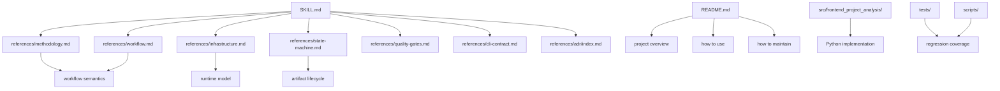

# Repository Layers

This page explains how the repository is organized and how each layer should be read.

## Layer Map

## What Each Layer Means

### 1. Skill and policy layer

- `SKILL.md` is the operational entrypoint
- `AGENTS.md` stores repository-wide rules
- `frontend-decomposition-methodology.md` is only a lightweight working note

### 2. Canonical reference layer

- `references/methodology.md` is the workflow source of truth
- `references/workflow.md` defines round outputs
- `references/infrastructure.md` defines runtime architecture and storage behavior
- `references/state-machine.md` defines lifecycle semantics
- `references/cli-contract.md` defines command behavior under the lifecycle gates
- `references/quality-gates.md` defines validation criteria
- `references/adr/index.md` defines the ADR index and points to architectural decision records and rationale
- `references/glossary.md` defines terms and naming

### 3. Product summary layer

- `README.md` explains what the project is, what it does, how to use it, and how to maintain it
- `references/document-map.md` explains which document is authoritative for each concern

### 4. Implementation layer

- `src/frontend_project_analysis/` contains the executable Python package
- `migrations/` contains database migrations

### 5. Verification layer

- `tests/` contains regression tests
- `scripts/` contains short wrappers for linting and testing

## Reading Order

If you are new to the repository, read in this order:

1. `README.md`
2. `references/document-map.md`
3. `references/methodology.md`
4. `references/infrastructure.md`
5. `references/state-machine.md`
6. `references/cli-contract.md`
7. `src/frontend_project_analysis/`
8. `tests/`
