# Repository Layers

This page shows the repository layers and their reading order.

## Layer Map

```mermaid
flowchart TB
A[SKILL.md] --> B[references/methodology.md]
A --> C[references/workflow.md]
A --> D[references/infrastructure.md]
A --> E[references/state-machine.md]
A --> E2[references/schema-sketch.md]
A --> E3[references/validation-matrix.md]
A --> E4[references/test-matrix.md]
A --> F[references/quality-gates.md]
A --> F2[references/glossary.md]
A --> G[references/structure.md]
A --> H[references/cli-contract.md]
A --> I[references/state-entrypoints.md]
A --> J[references/adr/index.md]
J[README.md] --> K[project overview]
J --> L[how to use]
J --> M[how to maintain]
    B --> N[workflow semantics]
    C --> N
    D --> O[runtime model]
    E --> P[artifact lifecycle]
    Q[src/frontend_project_analysis/] --> R[Python implementation]
    S[tests/] --> T[regression coverage]
    U[scripts/] --> T
```

## What Each Layer Means

### 1. Skill and policy layer

- `SKILL.md` is the operational entrypoint
- `AGENTS.md` stores repository-wide rules
- `frontend-decomposition-methodology.md` is only a lightweight working note and index

### 2. Canonical reference layer

- `references/methodology.md` is the workflow source of truth
- `references/workflow.md` defines round outputs
- `references/infrastructure.md` defines runtime architecture and storage behavior
- `references/state-machine.md` defines lifecycle semantics
- `references/schema-sketch.md` defines the node / edge / matrix placement for the workflow schema
- `references/validation-matrix.md` defines which checks are code-owned, LLM-owned, or projection-owned
- `references/test-matrix.md` defines the preferred layered test strategy and release coverage
- `references/glossary.md` defines preferred terminology
- `references/structure.md` defines output layout, naming rules, and file responsibilities
- `references/cli-contract.md` defines command behavior under the lifecycle gates
- `references/state-entrypoints.md` defines which commands may write state and which are read-only
- `references/quality-gates.md` defines validation criteria
- `references/adr/index.md` defines the ADR index and points to architectural decision records and rationale
- `references/document-map.md` defines which document is authoritative for each concern

### 3. Product summary layer

- `README.md` explains what the project is, what it does, how to use it, and how to maintain it

### 4. Implementation layer

- `src/frontend_project_analysis/` contains the executable Python package
- `migrations/` contains database migrations

### 5. Verification layer

- `tests/` contains regression tests
- `scripts/` contains short wrappers for linting and testing

## Reading Order

If you are new to the repository, read in this order:

1. `README.md`
2. `references/document-map.md`
3. `references/methodology.md`
4. `references/glossary.md`
5. `references/structure.md`
6. `references/infrastructure.md`
7. `references/state-machine.md`
8. `references/schema-sketch.md`
9. `references/validation-matrix.md`
10. `references/test-matrix.md`
11. `references/workflow.md`
12. `references/quality-gates.md`
13. `references/cli-contract.md`
14. `references/state-entrypoints.md`
14. `src/frontend_project_analysis/`
15. `tests/`
