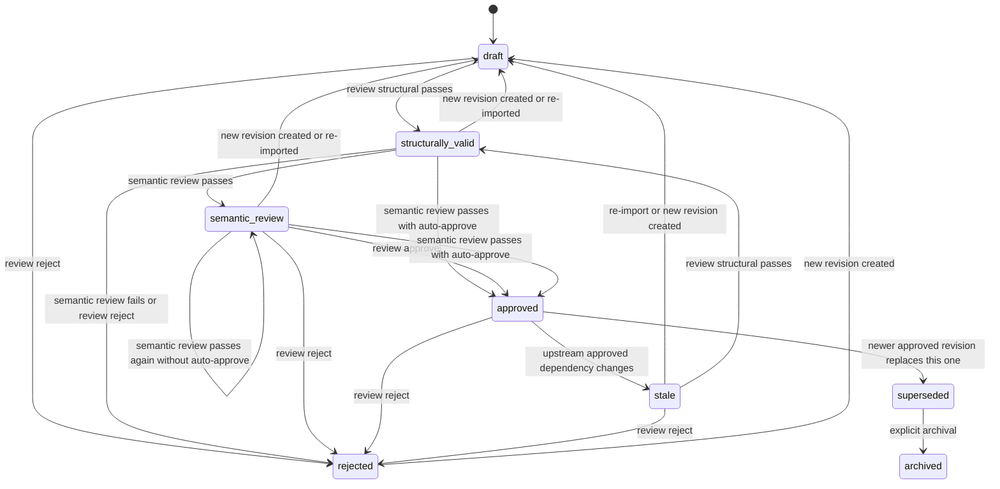

# Artifact State Machine

This page defines the lifecycle semantics for `ArtifactStatus`.

## Key Terms

- `revision`: one concrete version of an artifact.
- `current revision`: the revision currently attached to the artifact record.
- `fresh`: approved and not invalidated by upstream change.
- `stale`: no longer fresh because an upstream approved revision changed.

## Normative Rules

- The lifecycle MUST be revision-aware: every approval applies to one artifact revision, not to the abstract artifact forever.
- History MUST be append-only: approved history MUST NOT be rewritten in place.
- Stage gates MUST consume only approved and fresh upstream revisions.
- When an upstream revision changes, downstream approved artifacts MUST become stale instead of being silently rewritten.

## States

| State | Meaning | Entered by | Exited by |
| --- | --- | --- | --- |
| `draft` | The revision exists, but it has not yet passed structural validation or gate checks. | `artifact add`, `import manifest`, `import markdown-scan`, new revision creation | `review structural` success, `review reject` |
| `structurally_valid` | Deterministic checks passed and the revision is eligible for semantic review. | `review structural` success | `review semantic-run`, `review semantic-record`, `review approve`, `review reject`, new revision creation |
| `semantic_review` | Semantic review completed and the revision is waiting for explicit human approval. It is a holding state, not a final verdict. | `review semantic-run` or `review semantic-record` when semantic review passes and auto-approve is off | `review approve`, `review reject`, `review semantic-run` or `review semantic-record` with auto-approve on and `passed`, new revision creation |
| `approved` | The revision has been explicitly accepted and is currently fresh. | `review approve`, or semantic review with auto-approve on and `passed` | `review reject`, upstream invalidation can mark dependents stale, a newer approved revision can supersede it |
| `rejected` | The revision was rejected by semantic or human review. | `review semantic-run`, `review semantic-record`, `review reject` | new revision creation, re-import, or explicit rework |
| `stale` | The revision is no longer fresh because an upstream approved revision changed. | upstream approval of a dependency that this revision consumes | `review structural`, `review reject`, replacement by a newer revision, re-import |
| `superseded` | A newer revision has replaced this one as the current working truth for the same artifact. | explicit replacement by a newer approved revision | archival or historical retention only |
| `archived` | The revision is retained for history but is no longer part of active workflow. | retention or release closure | none in normal workflow |

## Transition Rules

## Reading Guide

- A user-provided brief, followed by `uv run fpa brief confirm --input <draft> --output <confirmed>` and then `uv run fpa init --project <key> --name <name> --brief-file <path>` or `uv run fpa init --project <key> --name <name> --brief <text>`, bootstraps the target repository with the workflow database, `analysis/` workspace, and local state directory before any round begins.
- `draft` is the default working state for a new revision.
- `structurally_valid` means the revision is structurally sound, but not yet semantically accepted.
- `semantic_review` means the semantic review result has been recorded, whether it came from an external LLM or from the current Codex / Claude Code host review path, and human approval is still pending unless auto-approve is enabled.
- `approved` is the terminal acceptance state for the current revision, not for the artifact forever.
- `rejected` means the current revision is not accepted.
- `stale` means an already approved downstream revision must be revisited because an upstream approved revision changed.
- `superseded` means the revision has been replaced by a newer approved revision of the same artifact.
- `archived` means the revision is retained for history only.

## Gate Semantics

Stage gates MUST be checked before any round begins:

- Round 2 may start only when the relevant Persona revision is `approved` and not `stale`.
- Round 3 may start only when the relevant Story Map revision is `approved` and not `stale`.
- Round 4 may start only when the relevant Page revision is `approved` and not `stale`.
- Round 5 may start only when the relevant Feature revision is `approved` and not `stale`.
- Round 6 may start only when all required upstream revisions are `approved` and not `stale`.

If a gate fails, the artifact MUST remain in its current revision state. Gate failure is derived from dependency freshness and approval state; it is not a separate persisted lifecycle state.

## Rollback Semantics

Rollback MUST be modeled as creating a new revision for an earlier-round artifact, not mutating the already approved revision in place.

When a new Persona revision is created after later rounds already exist:

- the new Persona revision starts in `draft`
- the previous Persona revision may be marked `superseded` once the new revision is approved
- every downstream Story Map, Page, Feature, GWT, or Feature Spec revision that depended on the previous Persona revision becomes `stale`
- downstream work may stay editable, but it cannot pass its next gate until the new upstream revision is revalidated and approved

The same rule applies to any earlier-round artifact that changes after later rounds have been approved.

For operator-oriented examples and the round-by-round recovery lookup, see [`references/workflow.md`](workflow.md).
